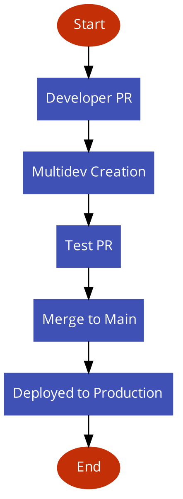

## Deep Dive into Drupal & Next.JS
The future of Drupal is headless.
Note: Next.js for Drupal has everything you need to build a next-generation front-end for your Drupal site.


## Agenda
* Digital Polygon Headless Architecture
* Data Fetching Techniques in Next JS
* Routing in Next.JS
* Frontend Sites on Pantheon
  * Multidev Connections
  * Decoupled Preview


## DP Headless Architecture


## Data Fetching Techniques in Next JS


## SSR: Server Side Rendering
With this approach, your application will send a request to server everytime it it rendered.

```
  export async function getServerSideProps(context) {
    return {
      props: {}, // will be passed to the page as props
    }
  }
```


### When to Use
* Only when data needs to fetched at request time.

Example: [Digital Polygon Blog](https://www.digitalpolygon.com/blog)


## SSG: Static Site Generation
With this approach, Next.js will render the page at build time.
```
  export async function getStaticProps(context) {
    return {
      props: {}, // will be passed to the page as props
    }
  }
```


### When to Use
* The data required to render the page is available at build time ahead of a user’s request
* Pages which are static in nature for e.g. about us page or a landing page
* The data can be publicly cached (not user-specific). This condition can be bypassed in certain specific situation by using a Middleware to rewrite the path.

Example: [Individual Blog Page](https://digitalpolygon.com/blog/3-website-technology-trends-watch-2023)


## Dynamic Routing
Use this method to serve pages which are similar in nature, but have different paths. This method can be combined with SSG or SSR as well.

```
// Generates `/posts/1` and `/posts/2`
export async function getStaticPaths() {
  return {
    paths: [{ params: { id: '1' } }, { params: { id: '2' } }],
    fallback: false, // can also be true or 'blocking'
  }
}
```


### When to Use
* The data comes from a headless CMS
* Pages must be pre-rendered and need to be very fast

Example: [Landing Pages](https://digitalpolygon.com/case-studies)


## Incremental Static Regeneration
Next.js allows you to create or update static pages after you ve built your site.


```
export async function getStaticProps() {
  const res = await fetch('https://.../posts')
  const posts = await res.json()

  return {
    props: {
      posts,
    },
    // Next.js will attempt to re-generate the page:
    // - When a request comes in
    // - At most once every 10 seconds
    revalidate: 10, // In seconds
  }
}
```


## Client Side Rendering
Client-side data fetching is useful when your page doesn't require SEO indexing, when you don't need to pre-render your data, or when the content of your pages needs to update frequently. Unlike the server-side rendering APIs, you can use client-side data fetching at the component level.

`Note: I haven't used it yet so cannot share a working example.`


## Code Demo


## Routing in Next.JS
* Next.js has a file-system based router built on the concept of pages.
* When a file is added to the pages directory, it's automatically available as a route.


### Index Routes
The router will automatically route files named index to the root of the directory.

- pages/index.js -> /
- pages/blog/index.js -> /blog


### Nested Routes
The router supports nested files. If you create a nested folder structure, files will automatically be routed in the same way still.

- pages/blog/first-post.js -> /blog/first-post
- pages/dashboard/settings/username.js -> /dashboard/settings/username


### Dynamic Routs
The router supports nested files. If you create a nested folder structure, files will automatically be routed in the same way still.

- pages/blog/[slug].js -> /blog/:slug (/blog/hello-world)
- pages/[username]/settings.js -> /:username/settings (/gaurav/settings)
- Catch All Routes -> pages/post/[...all].js -> /post/* (/post/2020/id/title)
- Optional Catch All Routes -> pages/post/[[...slug]].js -> /post, /post/a, /post/a/b


### Things to remember

- Predefined routes take precedence over dynamic routes, and dynamic routes over catch all routes.

  - pages/post/create.js - Will match /post/create
  - pages/post/[pid].js - Will match /post/1, /post/abc, etc. But not /post/create
  - pages/post/[...slug].js - Will match /post/1/2, /post/a/b/c, etc. But not /post/create, /post/abc


## Code Demo


## Frontend Site on Pantheon

### Where to look for site
As of now, a FE site in pantheon will need an organization. They can be found under `Frontend Sites` tab in org dashboard.


### Workflow
- Every PR in pantheon gets a multidev
- Merging the PR to main branch will deploy it to production
- By default every multidev is connected to production BE




### Multidev Connection
- With pantheon's environment variable, a multidev can be configured to a lower environment.


### Preview
- Backend can be configured to see how the page will look like without publishing.


## Code and Platform Walkthrough


## Questions?
